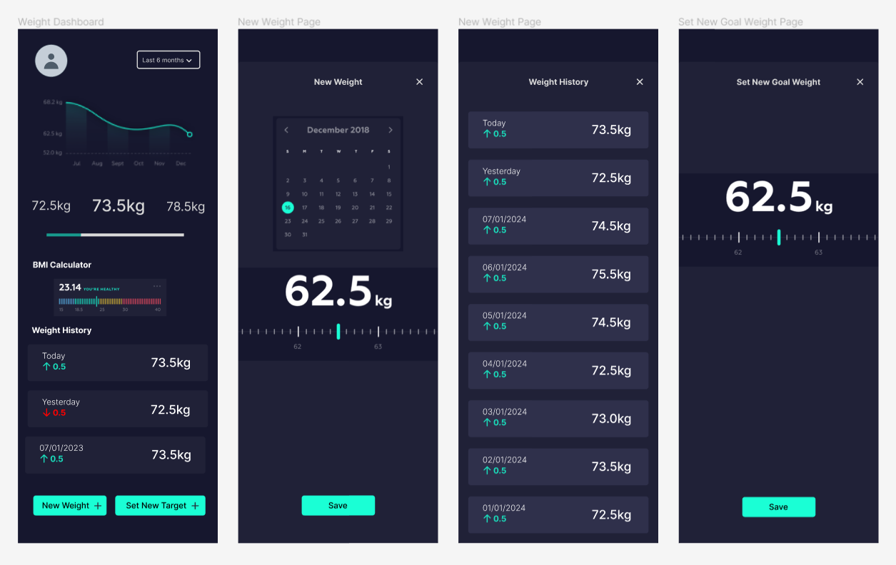

# Afya One Frontend
Frontend code for the Afya One Project

## Demo link:
Access my site at [https://still-in-construction.com](https://still-in-construction.com)

## Table of Content:

- [About The App](#about-the-app)
- [Screenshots](#screenshots)
- [Technologies](#technologies)
- [Setup](#setup)
- [Status](#status)
- [Credits](#credits)
- [License](#license)

## About The App
This repository serves to store the React code for the frontend for the Afya One Project. Afya One is a health and fitness logger that I'm developing to assist me in my health and fitness journey starting in 2024. Without too much long talk, that's the gist of the app.

## Screenshots

Here is a screenshot of the mockups of the weight tracking and logging module to give you a slight feel of the app.

## Technologies
I used React, TailwindCSS, Flowbite and some other technologies to build this app.

## Setup
- Download or clone the repository.
- Run `npm install`
- And all that other boring stuff...

## Status
Afya One development is still in progress. `Version 1` will be out soon.

## Credits
List of contriubutors:
- Just me, for now 🙂

## License
MIT license @ [Adala Wanyande](adalawanyande.netlify.app)