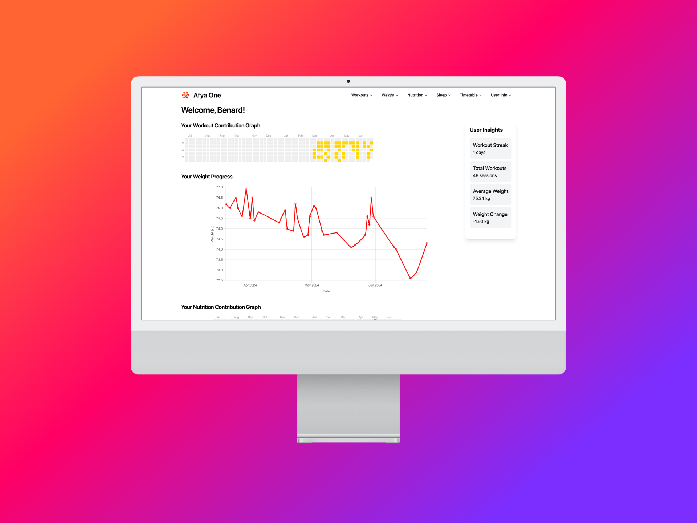

# Afya One

## Project Overview

Afya One is a comprehensive health and fitness tracking application designed to help users monitor their workouts, weight progress, and nutrition contributions. The dashboard provides insightful data visualizations and key health metrics to support users in achieving their fitness goals.

## Features

- **User Authentication:** Secure sign-up and sign-in functionality using Firebase Authentication.
- **Dashboard:** Interactive dashboard displaying workout, weight, and nutrition data.
- **User Insights:** Panel providing key health metrics including workout streaks, average weight, total workouts, and weight changes.
- **Data Visualization:** Charts and contribution graphs powered by Chart.js and react-github-contribution-calendar.
- **Responsive Design:** Fully responsive layout ensuring a seamless experience across devices.

## Screenshots

## Technologies Used

- **React:** Front-end library for building user interfaces.
- **Firebase:** Backend services including authentication and Firestore database.
- **Chart.js:** JavaScript library for data visualization.
- **Tailwind CSS:** Utility-first CSS framework for styling.
- **React Router:** Library for routing in React applications.
- **GitHub Contribution Calendar:** React component for rendering GitHub-like contribution graphs.

## Installation

1. Clone the repository:
   \`\`\`bash
   git clone https://github.com/adala-wanyande/afya-one.git
   \`\`\`

2. Navigate to the project directory:
   \`\`\`bash
   cd afya-one
   \`\`\`

3. Install the dependencies:
   \`\`\`bash
   npm install
   \`\`\`

4. Create a `.env` file in the root directory and add your Firebase configuration:
   \`\`\`env
   REACT_APP_FIREBASE_API_KEY=your_api_key
   REACT_APP_FIREBASE_AUTH_DOMAIN=your_auth_domain
   REACT_APP_FIREBASE_PROJECT_ID=your_project_id
   REACT_APP_FIREBASE_STORAGE_BUCKET=your_storage_bucket
   REACT_APP_FIREBASE_MESSAGING_SENDER_ID=your_messaging_sender_id
   REACT_APP_FIREBASE_APP_ID=your_app_id
   \`\`\`

5. Start the development server:
   \`\`\`bash
   npm start
   \`\`\`

## Usage

1. Sign up for a new account or sign in with your existing account.
2. Set up your user profile including your full name, date of birth, starting weight, and height.
3. Navigate to the dashboard to view your workout, weight, and nutrition data.
4. Use the user insights panel to track key health metrics and monitor your progress.

## Contributing

Contributions are welcome! Please fork the repository and submit a pull request with your changes.

## License

This project is licensed under the MIT License.
